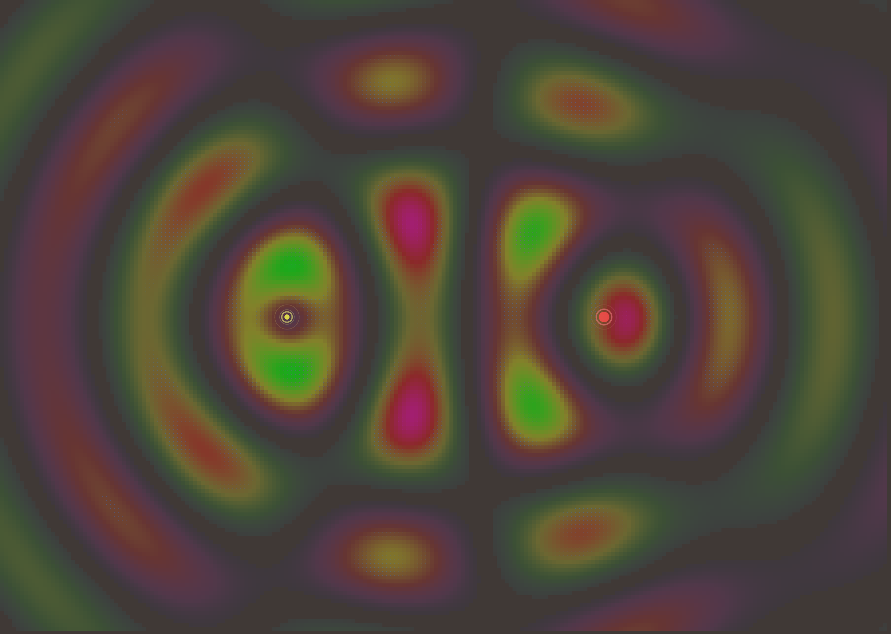

# Generative Gallery

A collection of interactive generative pieces built with React, TypeScript, and p5.js.

## Live Demo

[View Gallery](https://lowejosh.github.io/generative)

<div align="center">
  
  
  
</div>

<div align="center">
  
  
  
</div>

<div align="center">
  
  
  
</div>

<div align="center">
  
</div>

## Getting Started

### Prerequisites

- Node.js (v14 or higher)
- Yarn package manager

### Installation

```bash
git clone https://github.com/lowejosh/generative.git
cd generative
yarn install
```

### Development

```bash
yarn start
```

Open [http://localhost:3000](http://localhost:3000) to view the gallery.

## Creating New Sketches

Quickly create new artworks:

```bash
yarn makeSketch SketchName
```

Generates boilerplate for:

- Components
- Menu system
- Types
- File structure and imports

## Stack

- **React** 
- **TypeScript** 
- **p5.js** 
- **Material-UI** 
- **React Router** 

## Project Structure

```
src/
├── components/     # Reusable UI components
├── sketches/       # Individual sketches
├── hooks/          # Custom React hooks for p5.js integration
├── factories/      # Reusable generative algorithms
├── constants/      # Configuration and sketch registry
└── utils/          # Helper functions and utilities
```
